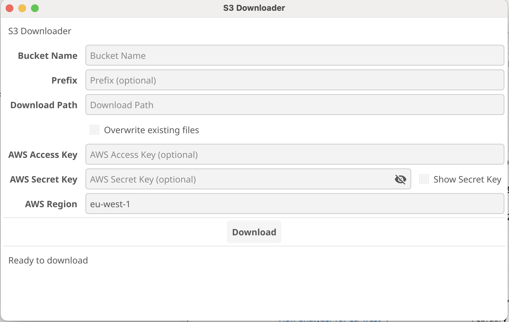

# S3 Downloader

S3 Downloader is a Go application with a graphical user interface that allows users to download files from Amazon S3 buckets easily and efficiently.



## Features

- User-friendly GUI built with Fyne
- Concurrent downloads for improved performance
- Progress tracking for downloads
- AWS region and credentials configuration
- Optional prefix filtering for selective downloads
- Ability to stop ongoing downloads

## Prerequisites

- Go 1.16 or later
- AWS account and credentials (Access Key and Secret Key)

## Installation

1. Clone the repository:

```bash
git clone https://github.com/ninenine/s3downloader.git
cd s3downloader
```

2. Install the dependencies:

```bash
go mod tidy
```

## Usage

1. Run the application:

```bash
go run cmd/main.go
```

2. Fill in the required fields in the GUI:

- Bucket Name: The name of your S3 bucket
- Prefix (optional): Folder or file prefix to filter downloads
- Download Path: Local directory to save downloaded files
- AWS Access Key and Secret Key (optional if using IAM roles)
- AWS Region: The region of your S3 bucket

3. Click the "Download" button to start downloading files.

4. Use the "Stop" button to cancel the download process if needed.

## Project Structure

```plaintext
s3downloader/
├── cmd/
│ └── main.go
├── internal/
│ ├── aws/
│ │ └── downloader.go
│ ├── ui/
│ │ ├── ui.go
│ │ └── components.go
│ └── progress/
│ └── progress.go
├── pkg/
│ └── fileutils/
│ └── fileutils.go
└── go.mod
```

- `cmd/main.go`: Entry point of the application
- `internal/aws/downloader.go`: AWS S3 download logic
- `internal/ui/`: UI-related code
- `internal/progress/`: Progress tracking structures
- `pkg/fileutils/`: Utility functions for file operations

## Contributing

Contributions are welcome! Please feel free to submit a Pull Request.

## License

This project is licensed under the MIT License - see the [LICENSE](LICENSE) file for details.

## Acknowledgments

- [Fyne](https://fyne.io/) for the GUI toolkit
- [AWS SDK for Go](https://aws.amazon.com/sdk-for-go/) for S3 interactions

## Support

If you encounter any problems or have any questions, please open an issue in the GitHub repository.
